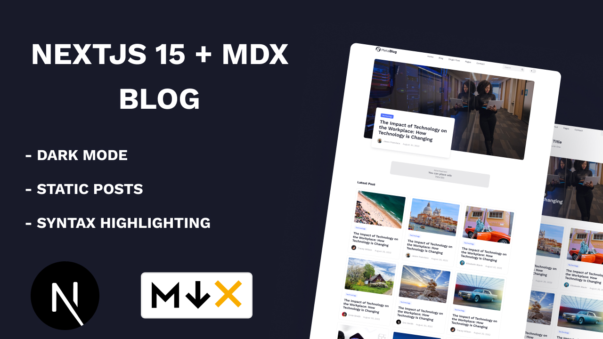

# How to Build an MDX Blog with Next.js 15

A Blog app built using Next.js 15, MDX (markdown), Prismjs and Tailwind CSS,. This app is static site that renders the markdown posts.



Youtube: [Watch](https://youtu.be/9Qd2VC0bsgQ)

## Getting Started

1.  **Clone the repository:**

    ```bash
    git clone https://github.com/thetechmaze/nextjs-mdx-blog.git
    ```

2.  **Install Dependencies**

    ```bash
    npm install
    ```

3.  **Run the development server**

    ```bash
    npm run dev
    ```

    Open http://localhost:3000 in your browser to see the app in action.

## Deployment

To Deploy this app, you can use platforms like Vercel or Netlify. Ensure you have your environment variables set correctly on the chosen platform.

## License

This project is open source and available under the [MIT Licence](./LICENCE).
